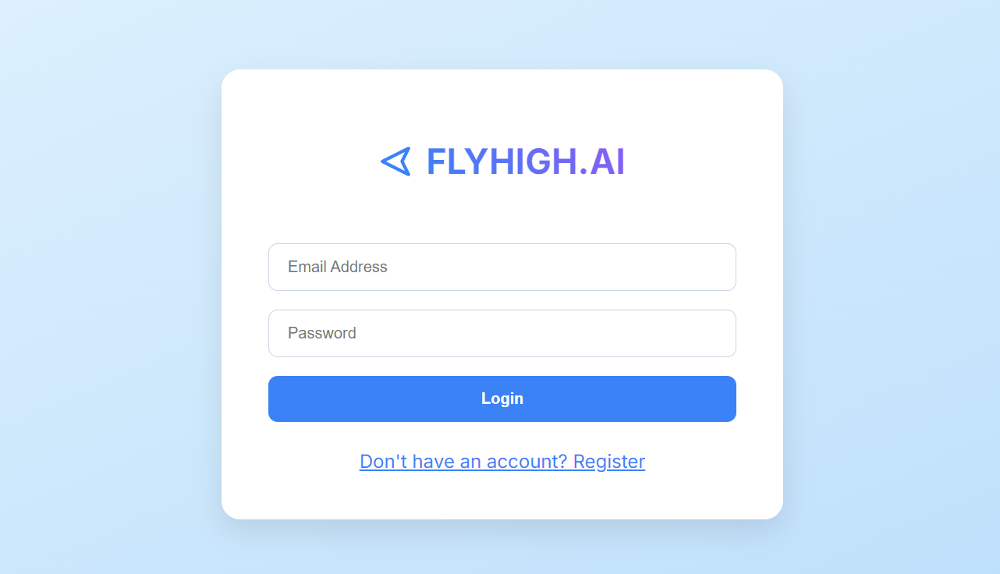
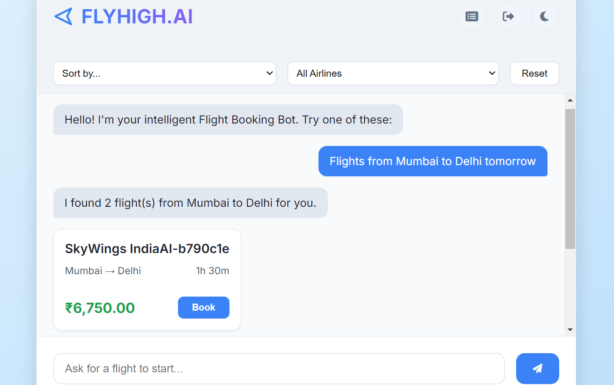
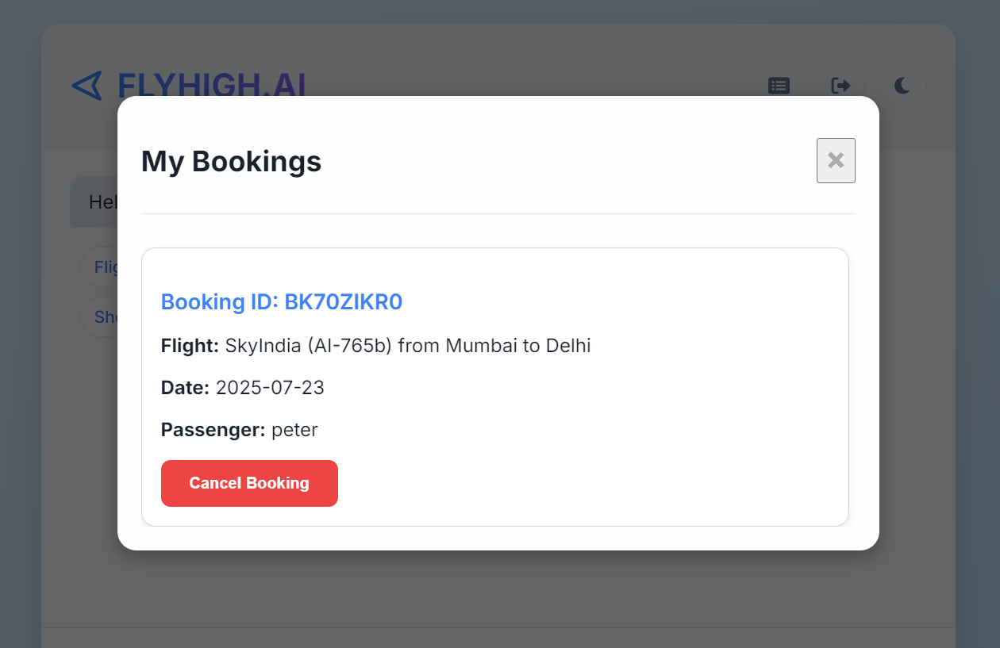

# **FLYHIGH.AI: Intelligent Conversational Booking Agent**

FLYHIGH.AI is a full-stack, AI-powered web application that redefines the flight booking experience. It features a sophisticated conversational interface that allows users to search for and book flights using natural language in multiple languages. This project demonstrates a complete, secure, and modern SaaS-like application architecture, perfect for showcasing advanced web development and AI integration skills.

## **✨ Key Features**

* **Conversational AI Chat**: At its core, the bot uses a powerful AI model (Google's Gemini) to understand user requests, manage conversation context, and ask for missing details.  
* **Multilingual Support**: Users can interact with the bot in **English**, **Hindi (Devanagari)**, and **Hinglish (Romanized Hindi)**. The bot detects the language and responds accordingly.  
* **Dynamic Flight Generation**: If no flights are found in the static data, the AI generates plausible, "fake" flight options on the fly, ensuring the user always has a result to interact with.  
* **Secure User Authentication**: The application is secured with a robust JWT (JSON Web Token) based authentication system. Users can register, log in, and have their sessions securely managed.  
* **Full Booking Lifecycle**: Users can search for flights, view results, provide passenger details, and complete a simulated payment process to confirm their booking.  
* **Personalized Itinerary Management**: Logged-in users can view a list of their own past bookings and have the ability to cancel them. The system ensures users can only access and modify their own data.  
* **Modern Frontend**: A clean, responsive user interface built with vanilla JavaScript, featuring a custom logo, dark mode, interactive modals, toast notifications, and dynamic flight filtering/sorting.

## **🛠️ Tech Stack**

### **Frontend**

| Technology | Description |
| :---- | :---- |
| **HTML5** | Structures the web application. |
| **CSS3** | Provides custom styling, responsiveness, and dark mode. |
| **Vanilla JavaScript** | Manages all client-side logic, state, and API interactions. |
| **Font Awesome** | Used for icons throughout the application. |
| **serve** | A simple, zero-configuration static server for running the frontend. |

### **Backend**

| Technology | Description |
| :---- | :---- |
| **Node.js** | The JavaScript runtime environment for the server. |
| **Express.js** | A minimal and flexible Node.js web application framework. |
| **MongoDB** | A NoSQL database used to store user and booking information. |
| **Mongoose** | An ODM (Object Data Modeling) library for MongoDB and Node.js. |
| **JSON Web Token (JWT)** | For implementing secure user authentication. |
| **bcrypt.js** | For hashing user passwords before storing them. |
| **dotenv** | For managing environment variables. |
| **CORS** | For enabling Cross-Origin Resource Sharing. |

### **AI & APIs**

| Technology | Description |
| :---- | :---- |
| **Google Gemini API** | Powers the natural language understanding, response generation, and dynamic flight creation. |
| **Axios** | A promise-based HTTP client for making API calls to the Gemini service. |

## **🚀 Setup and Installation**

This project is a monorepo containing two main packages: flight-bot-backend and flight-bot-frontend.

### **Prerequisites**

* Node.js and npm (or yarn) installed.  
* Access to a MongoDB database (either local or a cloud service like MongoDB Atlas).  
* A Google Gemini API Key.

### **1\. Backend Setup (flight-bot-backend)**

First, navigate into the backend directory:
cd flight-bot-backend

Install the backend dependencies:
npm install

Next, create a .env file inside the flight-bot-backend directory. Add the following variables:

\# Database  
MONGO\_URI=your\_mongodb\_connection\_string

\# Security  
JWT\_SECRET=a\_very\_strong\_and\_long\_secret\_key\_for\_jwt

\# Google AI  
GEMINI\_API\_KEY=your\_google\_gemini\_api\_key

Now, you can start the backend server (while still inside the flight-bot-backend folder):
node server.js

The server should now be running on http://localhost:5000.

### **2\. Frontend Setup (flight-bot-frontend)**

The frontend is built with static HTML, CSS, and JavaScript files and can be run using the serve package.

First, install serve globally if you haven't already:

npm install \-g serve

Then, from the root directory of the project (flight-bot/), run the following command to serve the frontend folder:
serve flight-bot-frontend

This will start a local server, typically on a port like http://localhost:3000. Your terminal will show the exact address.

You can now open your browser and navigate to the provided address (e.g., http://localhost:3000/login.html) to use the application.

## **✈️ How to Use**

1. **Register/Login**: Start by creating a new account or logging in with existing credentials on the login page.  
2. **Start a Conversation**: Once logged in, you'll be taken to the chat interface. You can start by typing a query in English, Hindi, or Hinglish. Here are some examples you can try:  
   **English**  
   Find me a flight from Mumbai to Delhi tomorrow  
   I need to go to Bengaluru on 2025-07-25  
   Show flights to Pune

   **Hinglish (Romanized Hindi)**  
   kal ke liye pune se chandigarh ki flight dikhao  
   parso delhi ke liye flight hai?

   **Hindi (Devanagari)**  
   मुंबई से दिल्ली के लिए कल की फ्लाइट दिखाओ  
   मुझे बेंगलुरु के लिए एक उड़ान चाहिए

3. **View & Filter Flights**: The bot will display a list of available flights. You can use the filter and sort options to narrow down the results.  
4. **Book a Flight**: Click the "Book" button on any flight card.  
5. **Enter Details**: A modal will appear asking for passenger and contact information.  
6. **Simulated Payment**: After filling in passenger details, a payment modal will appear. Enter the dummy card details to proceed.  
7. **Confirmation**: Your booking is now confirmed\!  
8. **Manage Bookings**: Click the "My Bookings" icon in the header to view all your past bookings and cancel them if needed.

## **🔮 Future Enhancements**

* **Real-time Flight APIs**: Integrate with a real flight data provider like Skyscanner or Amadeus to provide live flight information.  
* **Email/SMS Notifications**: Send booking confirmation details to the user's email or phone.  
* **Round-Trip & Multi-City**: Enhance the AI to handle more complex queries like round-trip or multi-city flight searches.  
* **User Profile Management**: Allow users to update their profile information and password.  
* **Admin Dashboard**: A separate interface for an administrator to view and manage all user bookings in the system.